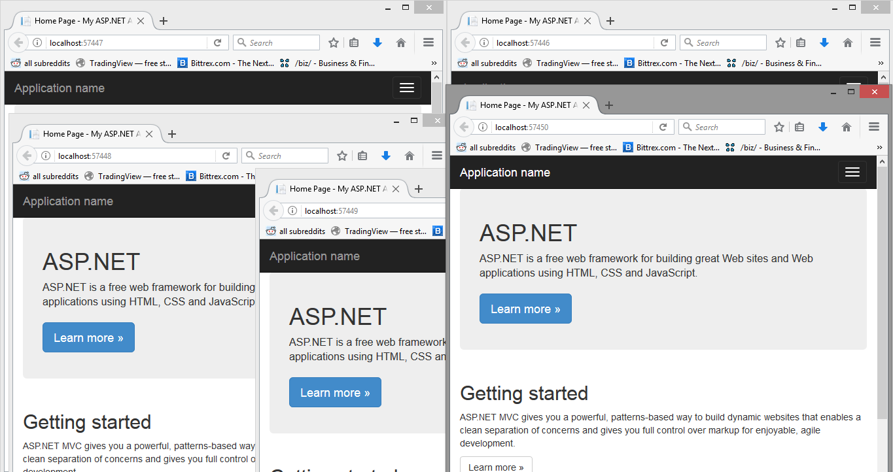

# Multiple-Instances-WebServer-.Net

A simple batch script to open multiple instances of the same web server for .NET on different ports. I encountered a problem when trying to duplicate the same webserver. Could not find any help online so I decided to create these scripts. Another solution would be to copy and paste the program and change the port manually. Feel free to give feedback and improvements. Note: do not save applicationhost.config with notepad++ since it will mess with the configuration needed by the iisexpress, use default notepad instead.

## Modifications

Depending on the location of the scripts, change the cd accordingly. Also before running the script, change the defaultPortNumber to the starting port number of your program.

## Example



## Known Bugs

When trying to merge both scripts, the iisexpress gives an error. Feel free to try me why because I have no clue (Could be the same issue as saving with notepad++).

# Running the scripts

Add iis express to the PATH environment variable. In my case the iss location was:

```
C:\Program Files\IIS Express
```

Adjust the location of applicationhost.config found in .vs folder (hidden) and change the starting port number of both scripts to the port number of the program. To run the scripts, first run make-copies-of-instances.bat then run make-copies-of-instances.bat. Argument can be passed indicating the number of instance. 